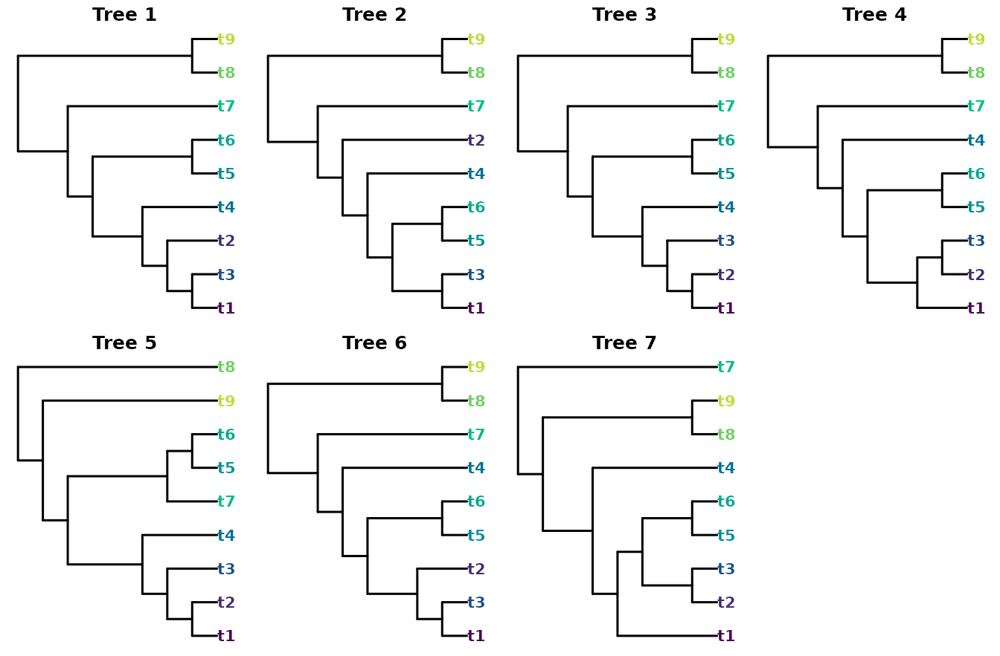
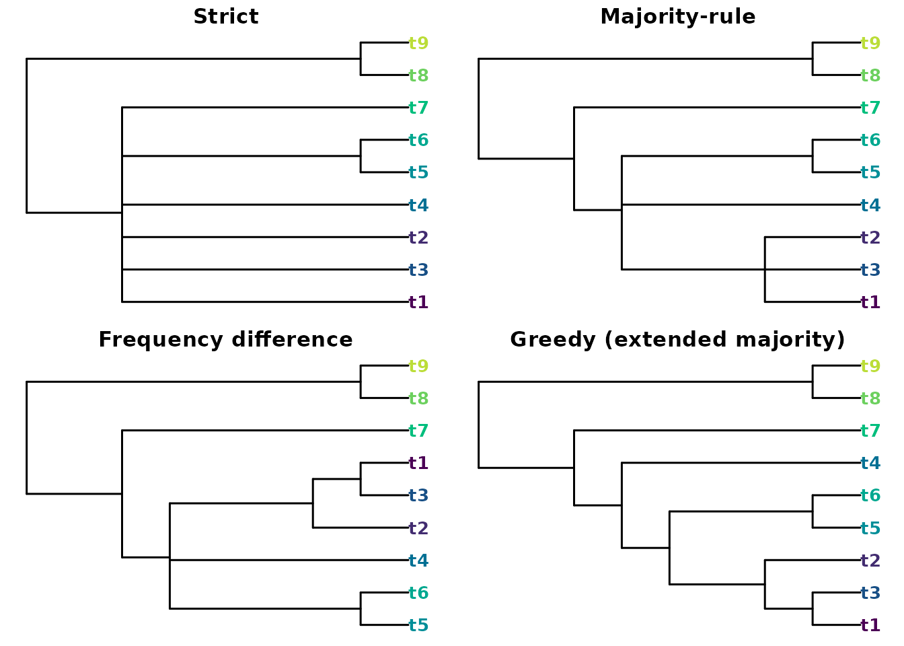
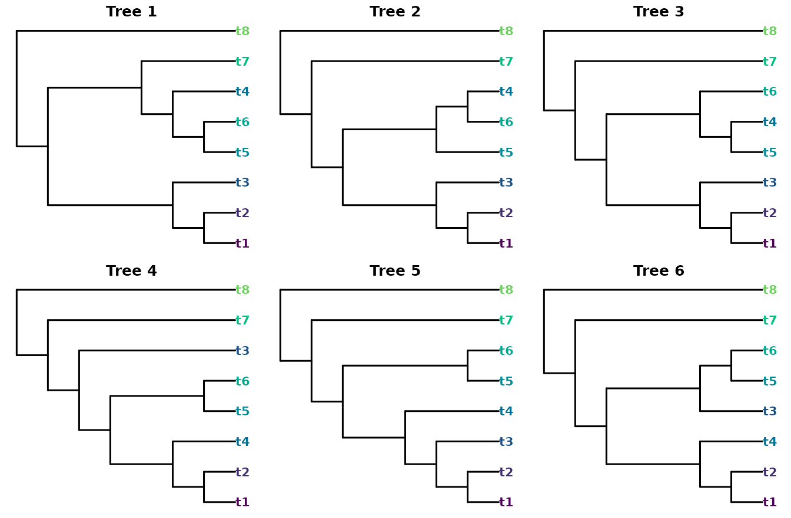
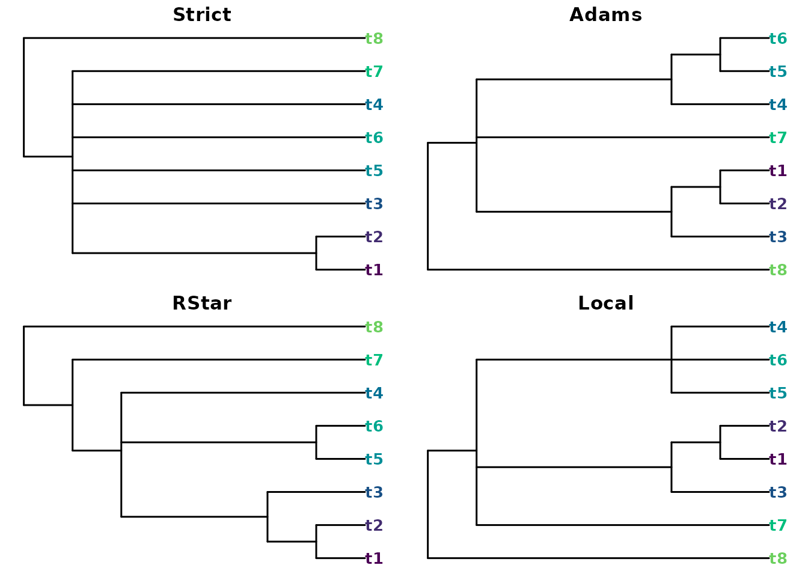
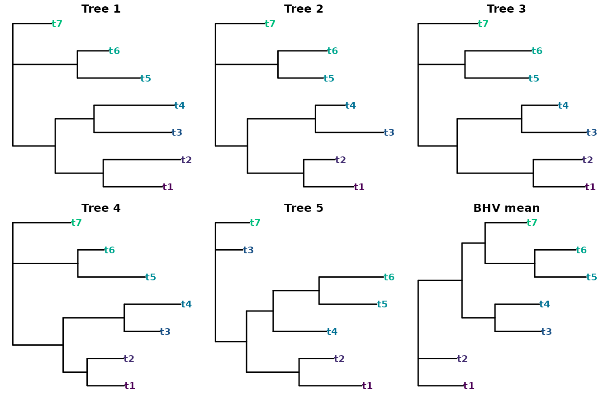

# Summarizing tree samples with ConsTree

‘ConsTree’ condenses a collection of phylogenetic trees – a bootstrap or
Bayesian posterior sample, perhaps – into a single summary tree. It
implements two categories of method: (i) those that retain groupings
based on a voting rule; and (ii) summary trees selected based on their
distance from other trees in the sample.

``` r

# Load packages with:
library("ConsTree")
library("TreeTools", quietly = TRUE)
```

### Split-selection methods

The split-selection methods differ only in *which* groupings they keep,
so they form a nested sequence of increasing resolution. To see this,
take seven trees that share a backbone but disagree on the placement of
a few leaves:

``` r

trees <- ape::read.tree(text = c(
  "((((((t1,t3),t2),t4),(t5,t6)),t7),(t8,t9));",
  "((((((t1,t3),(t5,t6)),t4),t2),t7),(t8,t9));",
  "((((((t1,t2),t3),t4),(t5,t6)),t7),(t8,t9));",
  "(((((t1,(t2,t3)),(t5,t6)),t4),t7),(t8,t9));",
  "((((((t1,t2),t3),t4),(t7,(t5,t6))),t9),t8);",
  "((((((t1,t3),t2),(t5,t6)),t4),t7),(t8,t9));",
  "((((t1,((t2,t3),(t5,t6))),t4),(t8,t9)),t7);"))
```

``` r

# Colour leaf labels consistently
nTip <- 9
leafCol <- setNames(hcl.colors(nTip + 1), TipLabels(nTip + 1))
plotCons <- function(tree, main = "") {
  plot(tree, tip.color = leafCol[tree$tip.label], main = main,
       font = 2, cex = 1, edge.width = 1.5)
}
```

``` r

oldPar <- par(mfrow = c(2, 4), mar = c(0.5, 0.5, 1.5, 0.5))
for (i in seq_along(trees)) plotCons(trees[[i]], main = paste("Tree", i))
par(oldPar)
```



Each method retains a superset of the groupings kept by the one before
it:

``` r

oldPar <- par(mfrow = c(2, 2), mar = c(0.5, 0.5, 1.5, 0.5))
plotCons(Strict(trees),    "Strict")
plotCons(Majority(trees),  "Majority-rule")
plotCons(Frequency(trees), "Frequency difference")
plotCons(Greedy(trees),    "Greedy (extended majority)")
```



``` r

par(oldPar)
```

``` r

data.frame(
  method  = c("Strict", "Majority", "Frequency", "Greedy"),
  splits  = c(NSplits(Strict(trees)),    NSplits(Majority(trees)),
              NSplits(Frequency(trees)),  NSplits(Greedy(trees)))
)
#>      method splits
#> 1    Strict      2
#> 2  Majority      4
#> 3 Frequency      5
#> 4    Greedy      6
```

[`Strict()`](https://constree.github.io/reference/Strict.md) keeps only
the two groupings that occur in every tree;
[`Majority()`](https://constree.github.io/reference/Majority.md) adds
those that occur in more than half;
[`Frequency()`](https://constree.github.io/reference/Frequency.md) keeps
any grouping that beats every grouping it conflicts with; and
[`Greedy()`](https://constree.github.io/reference/Greedy.md) adds
compatible groupings, most frequent first, giving the most resolved
summary.

Simply counting splits overlooks the possibility that some splits are
more heavily contradicted by other trees.
[`Loose()`](https://constree.github.io/reference/Loose.md) (the
semi-strict, or combinable-component, consensus) keeps every grouping
that no tree contradicts, whereas
[`MajorityPlus()`](https://constree.github.io/reference/MajorityPlus.md)
keeps any grouping that is displayed by more trees than contradict it.

### Rooted methods

[`Adams()`](https://constree.github.io/reference/Adams.md),
[`RStar()`](https://constree.github.io/reference/RStar.md) and
[`Local()`](https://constree.github.io/reference/Local.md) treat the
input as **rooted** and reason about clusters and rooted triplets rather
than unrooted splits. They may therefore recover structure that an
unrooted strict consensus would collapse:

``` r

rTrees <- ape::read.tree(text = c(
  "((((t1,t2),t3),(((t5,t6),t4),t7)),t8);",
  "(((((t1,t2),t3),(t5,(t6,t4))),t7),t8);",
  "(((((t1,t2),t3),((t5,t4),t6)),t7),t8);",
  "((((((t1,t2),t4),(t5,t6)),t3),t7),t8);",
  "((((((t1,t2),t3),t4),(t5,t6)),t7),t8);",
  "(((((t1,t2),t4),(t3,(t5,t6))),t7),t8);"))
```

``` r

oldPar <- par(mfrow = c(2, 3), mar = c(0.5, 0.5, 1.5, 0.5))
for (i in seq_along(rTrees)) plotCons(rTrees[[i]], main = paste("Tree", i))
```



``` r

par(oldPar)
```

The unrooted strict consensus keeps a single grouping, but the rooted
methods recover more:

``` r

oldPar <- par(mfrow = c(2, 2), mar = c(0.5, 0.5, 1.5, 0.5))
plotCons(Strict(rTrees), "Strict")
plotCons(Adams(rTrees),  "Adams")
plotCons(RStar(rTrees),  "RStar")
plotCons(Local(rTrees),  "Local")
```



``` r

par(oldPar)
```

``` r

data.frame(
  method = c("Strict", "Adams", "RStar", "Local"),
  splits = c(NSplits(Strict(rTrees)), NSplits(Adams(rTrees)),
             NSplits(RStar(rTrees)),  NSplits(Local(rTrees)))
)
#>   method splits
#> 1 Strict      1
#> 2  Adams      4
#> 3  RStar      4
#> 4  Local      3
```

An [`Adams()`](https://constree.github.io/reference/Adams.md) consensus
may display groupings that no input tree contains.
[`RStar()`](https://constree.github.io/reference/RStar.md) keeps each
rooted triplet that wins a plurality over both alternatives;
[`Local()`](https://constree.github.io/reference/Local.md) returns the
minimum local consensus of the shared triplets (limited to 20 leaves,
and best suited to congruent samples).

### Distance and branch-length summaries

Maximizing the counts of individual groupings is equivalent to finding
the tree with the minimum total Robinson–Foulds distance to all input
trees. As the Robinson–Foulds distance exhibits shortcomings (Smith,
2020), other distance measures potentially provide more instructive
summary trees.

[`Quartet()`](https://constree.github.io/reference/Quartet.md) is the
quartet-distance analogue, seeking (an approximation to) the tree that
minimizes the total quartet distance to the inputs instead (Takazawa et
al., 2026). Because the quartet distance gives extra weight to deep
branches, the result is often more resolved than the majority-rule tree:

``` r

c(majority = NSplits(Majority(trees)),
  quartet  = NSplits(Quartet(trees)))
#> majority  quartet 
#>        4        5
```

`median.multiPhylo()` in the
[‘TreeDist’](https://ms609.github.io/TreeDist/) package allows such a
median to be selected from within a sample of trees under any metric;
unlike the previous approaches, this is restricted to tree topologies
within the sample.

When the trees carry edge lengths, two further summaries become
available.
[`Average()`](https://constree.github.io/reference/Average.md) returns
the tree whose path-length (patristic) distances best match the average
of the input distance matrices, while
[`BHVMean()`](https://constree.github.io/reference/BHVMean.md) computes
the Fréchet mean in Billera–Holmes–Vogtmann treespace, with branch
lengths;
[`BHVDistance()`](https://constree.github.io/reference/BHVDistance.md),
`BHVPairwiseDistances()` and
[`BHVVariance()`](https://constree.github.io/reference/BHVMean.md)
provide the underlying geodesic distances and dispersion.

``` r

blTrees <- ape::read.tree(text = c(
  "(((t1:0.64,t2:0.84):0.52,(t3:0.84,t4:0.87):0.42):0.46,(t5:0.68,t6:0.34):0.70,t7:0.42);",
  "(((t1:0.64,t2:0.40):0.72,(t3:0.87,t4:0.38):0.87):0.41,(t5:0.58,t6:0.63):0.80,t7:0.63);",
  "(((t1:0.53,t2:0.50):0.78,(t3:0.66,t4:0.37):0.66):0.40,(t5:0.65,t6:0.68):0.48,t7:0.61);",
  "(((t1:0.48,t2:0.47):0.31,(t3:0.46,t4:0.73):0.79):0.65,(t5:0.87,t6:0.34):0.84,t7:0.75);",
  "(((t1:0.85,t2:0.47):0.71,(t4:0.72,(t5:0.78,t6:0.87):0.62):0.36):0.42,t3:0.37,t7:0.46);"))
meanTree <- BHVMean(blTrees)
oldPar <- par(mfrow = c(2, 3), mar = c(0.5, 0.5, 1.5, 0.5))
for (i in seq_along(blTrees)) plotCons(blTrees[[i]], main = paste("Tree", i))
plotCons(meanTree, main = "BHV mean")
```



``` r

par(oldPar)
```

``` r

BHVVariance(blTrees, mean = meanTree)
#> [1] 0.5749739
```

The mean recovers the shared topology. The two groupings that every tree
displays keep their full length; the two that the fifth tree contradicts
exhibit shorter branches.

## Method selection

The most appropriate method in a particular circumstance depends on the
value of precision versus accuracy; trees that resolve more groupings
are progressively less likely to be accurate (Smith, 2019).

By omitting unstable leaves from the input trees, perhaps via the
[‘Rogue’](https://ms609.github.io/Rogue/) package, it is possible to
improve the resolution of consensus trees by reconciling groupings that
only differ in the position of rogue taxa (Smith, 2022).

## References

Smith, M. R. (2019). Bayesian and parsimony approaches reconstruct
informative trees from simulated morphological datasets. *Biology
Letters*, *15*, 20180632. <https://doi.org/10.1098/rsbl.2018.0632>

Smith, M. R. (2020). Information theoretic Generalized Robinson–Foulds
metrics for comparing phylogenetic trees. *Bioinformatics*, *36*(20),
5007–5013. <https://doi.org/10.1093/bioinformatics/btaa614>

Smith, M. R. (2022). Using information theory to detect rogue taxa and
improve consensus trees. *Systematic Biology*, *71*(5), 1088–1094.
<https://doi.org/10.1093/sysbio/syab099>

Takazawa, Y., Takeda, A., Hayamizu, M., & Gascuel, O. (2026).
Outperforming the majority-rule consensus tree using fine-grained
dissimilarity measures. *bioRxiv*.
<https://doi.org/10.64898/2026.03.16.712085>
